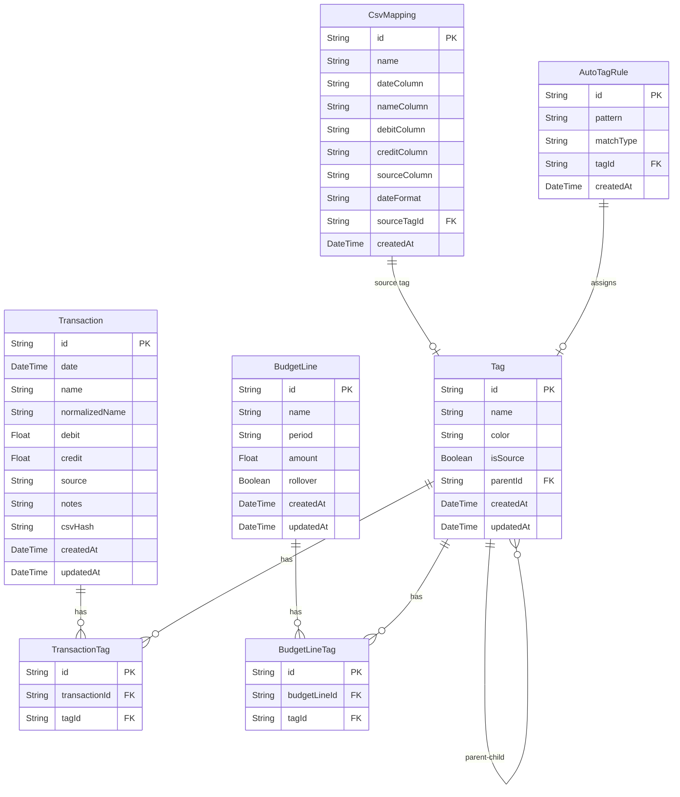
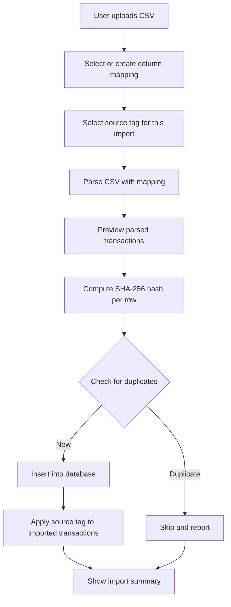
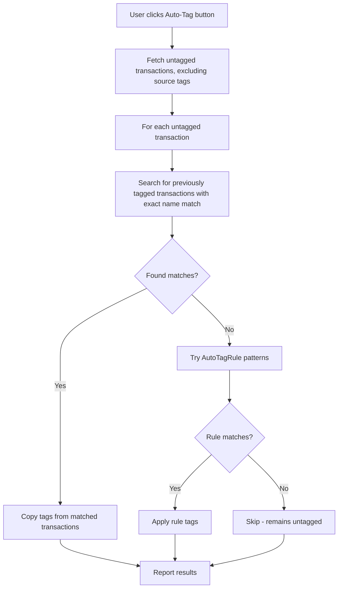
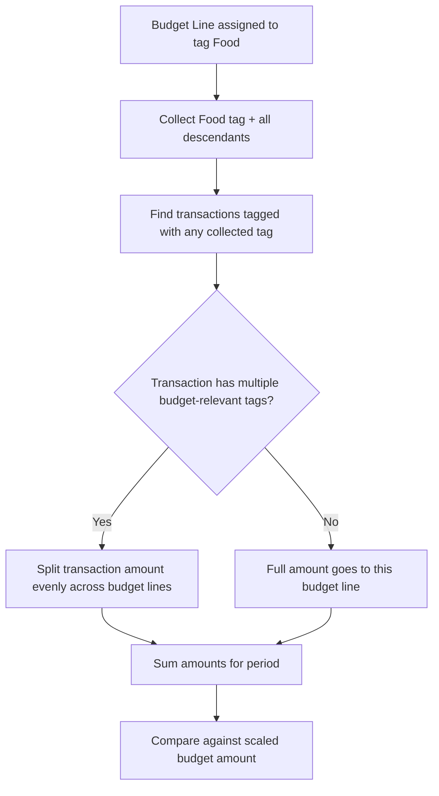
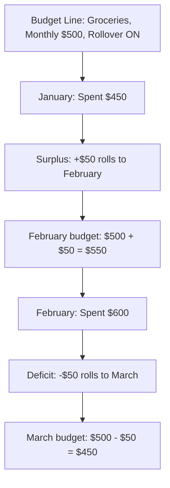
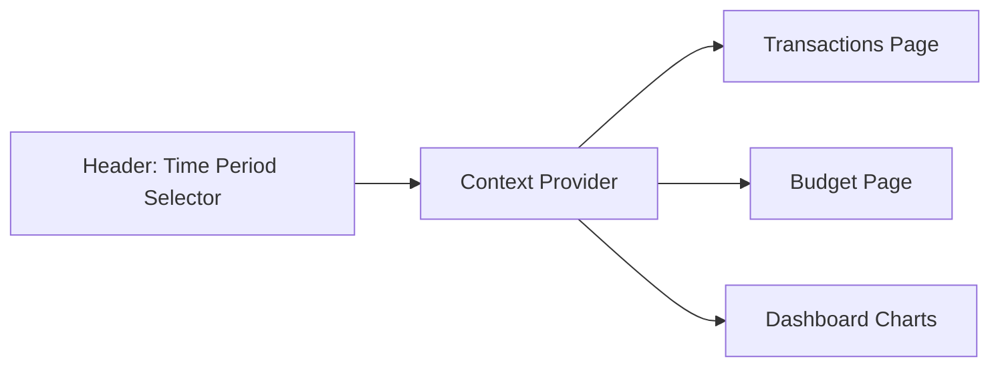

# Budget Buddy — Architecture Plan

## Overview

Budget Buddy is a local-first personal finance app built with Next.js App Router, Prisma + SQLite, shadcn/ui, Tailwind
CSS, and recharts. It enables CSV-based transaction import, flexible tag-based categorization with auto-tagging, nested
tag hierarchies, source tracking, and budget tracking with rollover support.

---

## Tech Stack

| Layer           | Technology                               |
| --------------- | ---------------------------------------- |
| Framework       | Next.js 15+ with App Router              |
| Language        | TypeScript (strict)                      |
| Database        | SQLite via Prisma ORM                    |
| UI Components   | shadcn/ui                                |
| Styling         | Tailwind CSS v4                          |
| Charts          | recharts                                 |
| Package Manager | pnpm                                     |
| Linting         | ESLint (flat config, eslint-config-next) |
| Formatting      | Prettier with tailwind plugin            |

---

## Database Schema



### Key Design Decisions

- **`csvHash`** on Transaction: SHA-256 hash of `date + name + debit + credit + source` for duplicate detection
- **`normalizedName`** on Transaction: Lowercase version of `name` with generated numbers, reference codes, and extra whitespace removed. Used for auto-tagging matching and grouping similar transactions
- **`notes`** on Transaction: Free-text notes field for user comments, not used in budget calculations
- **Tag hierarchy**: Self-referencing `parentId` on Tag table; unlimited nesting depth
- **`isSource`** on Tag: Boolean flag distinguishing source tags from category tags. Source tags represent
  accounts/cards and are excluded from budget calculations
- **BudgetLine period**: Enum-like string — `monthly`, `biweekly`, `yearly`
- **BudgetLine rollover**: Boolean flag — when true, unspent/overspent amounts carry to next period
- **BudgetLineTag**: Many-to-many — a budget line can track multiple tags
- **CsvMapping**: Stores reusable column mapping configurations for different bank exports. Has an optional
  `sourceTagId` to auto-apply a source tag to all imported transactions
- **AutoTagRule**: Stores patterns for auto-tagging. `matchType` is `exact` or `regex`. Used when user clicks auto-tag
  button

---

## Prisma Schema

```prisma
datasource db {
  provider = "sqlite"
  url      = "file:./dev.db"
}

generator client {
  provider = "prisma-client-js"
}

model Transaction {
  id             String           @id @default(cuid())
  date           DateTime
  name           String
  normalizedName String
  debit          Float            @default(0)
  credit         Float            @default(0)
  source         String           @default("")
  notes          String           @default("")
  csvHash        String           @unique
  createdAt      DateTime         @default(now())
  updatedAt      DateTime         @updatedAt
  tags           TransactionTag[]

  @@index([normalizedName])
}

model Tag {
  id           String           @id @default(cuid())
  name         String
  color        String           @default("#6B7280")
  isSource     Boolean          @default(false)
  parentId     String?
  parent       Tag?             @relation("TagHierarchy", fields: [parentId], references: [id])
  children     Tag[]            @relation("TagHierarchy")
  createdAt    DateTime         @default(now())
  updatedAt    DateTime         @updatedAt
  transactions TransactionTag[]
  budgetLines  BudgetLineTag[]
  autoTagRules AutoTagRule[]
  csvMappings  CsvMapping[]
}

model TransactionTag {
  id            String      @id @default(cuid())
  transactionId String
  tagId         String
  transaction   Transaction @relation(fields: [transactionId], references: [id], onDelete: Cascade)
  tag           Tag         @relation(fields: [tagId], references: [id], onDelete: Cascade)

  @@unique([transactionId, tagId])
}

model BudgetLine {
  id        String          @id @default(cuid())
  name      String
  period    String          // "monthly" | "biweekly" | "yearly"
  amount    Float
  rollover  Boolean         @default(false)
  createdAt DateTime        @default(now())
  updatedAt DateTime        @updatedAt
  tags      BudgetLineTag[]
}

model BudgetLineTag {
  id           String     @id @default(cuid())
  budgetLineId String
  tagId        String
  budgetLine   BudgetLine @relation(fields: [budgetLineId], references: [id], onDelete: Cascade)
  tag          Tag        @relation(fields: [tagId], references: [id], onDelete: Cascade)

  @@unique([budgetLineId, tagId])
}

model CsvMapping {
  id           String   @id @default(cuid())
  name         String   @unique
  dateColumn   String
  nameColumn   String
  debitColumn  String
  creditColumn String
  sourceColumn String   @default("")
  dateFormat   String   @default("YYYY-MM-DD")
  sourceTagId  String?
  sourceTag    Tag?     @relation(fields: [sourceTagId], references: [id])
  createdAt    DateTime @default(now())
}

model AutoTagRule {
  id        String   @id @default(cuid())
  pattern   String
  matchType String   // "exact" | "regex"
  tagId     String
  tag       Tag      @relation(fields: [tagId], references: [id], onDelete: Cascade)
  createdAt DateTime @default(now())
}
```

---

## Application Architecture

### Directory Structure

```
budget-buddy/
├── prisma/
│   ├── schema.prisma
│   ├── migrations/
│   └── dev.db
├── src/
│   ├── app/
│   │   ├── layout.tsx              # Root layout with header + time period selector
│   │   ├── page.tsx                # Dashboard / home
│   │   ├── transactions/
│   │   │   └── page.tsx            # Transactions table view
│   │   ├── tags/
│   │   │   └── page.tsx            # Tag management
│   │   ├── budget/
│   │   │   └── page.tsx            # Budget view
│   │   ├── import/
│   │   │   └── page.tsx            # CSV import
│   │   └── api/
│   │       ├── transactions/
│   │       │   └── route.ts
│   │       ├── tags/
│   │       │   └── route.ts
│   │       ├── budget-lines/
│   │       │   └── route.ts
│   │       ├── import/
│   │       │   └── route.ts
│   │       ├── csv-mappings/
│   │       │   └── route.ts
│   │       └── auto-tag/
│   │           └── route.ts
│   ├── components/
│   │   ├── ui/                     # shadcn components
│   │   ├── layout/
│   │   │   ├── header.tsx
│   │   │   ├── sidebar.tsx
│   │   │   └── time-period-selector.tsx
│   │   ├── transactions/
│   │   │   ├── transaction-table.tsx
│   │   │   ├── transaction-row.tsx
│   │   │   └── tag-picker.tsx
│   │   ├── tags/
│   │   │   ├── tag-tree.tsx
│   │   │   ├── tag-form.tsx
│   │   │   └── tag-badge.tsx
│   │   ├── budget/
│   │   │   ├── budget-table.tsx
│   │   │   ├── budget-line-form.tsx
│   │   │   └── budget-summary.tsx
│   │   ├── import/
│   │   │   ├── csv-upload.tsx
│   │   │   ├── csv-preview.tsx
│   │   │   └── mapping-form.tsx
│   │   └── charts/
│   │       ├── spending-chart.tsx
│   │       └── budget-vs-actual.tsx
│   ├── lib/
│   │   ├── prisma.ts               # Prisma client singleton
│   │   ├── csv-parser.ts           # CSV parsing with configurable mapping
│   │   ├── hash.ts                 # SHA-256 hashing for duplicate detection
│   │   ├── normalize.ts            # Transaction name normalization
│   │   ├── budget-calculator.ts    # Budget scaling, rollover, split logic
│   │   ├── auto-tagger.ts          # Auto-tagging engine (uses normalizedName)
│   │   └── date-utils.ts           # Period helpers
│   ├── hooks/
│   │   ├── use-time-period.ts      # Global time period state
│   │   └── use-tags.ts
│   └── types/
│       └── index.ts                # Shared TypeScript types
├── public/
├── .eslintrc.json
├── .prettierrc
├── tailwind.config.ts
├── tsconfig.json
├── next.config.ts
├── package.json
└── pnpm-lock.yaml
```

---

## Core Business Logic

### 1. CSV Import Flow



- Hash formula: `SHA256 of date|name|debit|credit|source`
- The `csvHash` column has a unique constraint — Prisma will reject duplicates
- Import summary shows: total rows, imported, skipped duplicates, errors
- **Source tag**: Each CSV mapping can have an associated source tag. When importing, all new transactions get tagged
  with this source tag. Examples: "Chequing Account", "Personal Credit Card", "Shared Credit Card"
- The `source` field from CSV (e.g., card number) is also stored on the transaction for reference

### 1b. Auto-Tagging



**Auto-tagging strategies** (applied in order):

1. **Normalized name match**: Find existing transactions with the same `normalizedName` that already have non-source tags. Copy those tags. This catches variations like different reference numbers on recurring transactions.
2. **AutoTagRule patterns**: Check stored regex or exact-match rules against the `normalizedName`. Apply the associated tag if matched.
3. **Unmatched**: Transaction remains untagged for manual review.

**Name normalization rules** (applied during import via `normalize.ts`):

1. Convert to lowercase
2. Remove sequences of 6+ digits (reference numbers, transaction IDs)
3. Remove common bank prefixes/suffixes (configurable)
4. Collapse multiple spaces into single space
5. Trim whitespace

Examples:

- `Internet Banking E-TRANSFER 105720422508 Microgreens` → `internet banking e-transfer microgreens`
- `Electronic Funds Transfer DEPOSIT CANADA LIFE` → `electronic funds transfer deposit canada life`
- `VISA DEBIT PUR 1234567890 UBER EATS` → `visa debit pur uber eats`

**AutoTagRule management**:

- Users can create rules in the Tags page: "If transaction name matches `UBER EATS.*` (regex), apply tag Restaurants"
- Rules are also auto-generated: when a user manually tags a transaction, offer to create a rule from that transaction
  name

### 2. Tag Hierarchy and Budget Rollup



**Tag descendant collection** is recursive:

- Given tag "Food" with children "Groceries" and "Restaurants"
- If "Restaurants" has child "Fast Food"
- Budget for "Food" includes transactions tagged: Food, Groceries, Restaurants, Fast Food

**Split logic**:

- Transaction of $100 tagged "Health" and "Sport"
- If both "Health" and "Sport" have budget lines: $50 counts toward each
- If only "Health" has a budget line: full $100 counts toward Health

### 3. Budget Period Scaling

| Budget Period | Viewing Monthly      | Viewing Yearly     | Viewing Custom          |
| ------------- | -------------------- | ------------------ | ----------------------- |
| Monthly $500  | $500                 | $6,000             | $500 × months in range  |
| Biweekly $200 | $200 × 2.1667 ≈ $433 | $200 × 26 = $5,200 | $200 × biweeks in range |
| Yearly $3,000 | $3,000 / 12 = $250   | $3,000             | $3,000 × years fraction |

For custom periods, calculate the fraction of the budget period that overlaps.

### 4. Budget Rollover



Rollover calculation:

1. For each completed period before the current one, compute `budget - actual`
2. Sum all these deltas to get cumulative rollover
3. Current period effective budget = base budget + cumulative rollover

---

## Global Time Period State

The time period selector lives in the header and uses React Context or Zustand to share state across all pages.



**Preset options**: Current Month, Current Year, Last Month, Last Year, Custom Range

**State shape**:

```typescript
type TimePeriod = {
  start: Date;
  end: Date;
  label: string;
  type: 'month' | 'year' | 'custom';
};
```

---

## API Routes Summary

| Method | Route                        | Description                                      |
| ------ | ---------------------------- | ------------------------------------------------ |
| GET    | `/api/transactions`          | List transactions with period filter, pagination |
| PATCH  | `/api/transactions/:id`      | Update transaction notes                         |
| POST   | `/api/transactions/:id/tags` | Add/remove tags from a transaction               |
| GET    | `/api/tags`                  | List all tags as tree                            |
| POST   | `/api/tags`                  | Create tag                                       |
| PUT    | `/api/tags/:id`              | Update tag                                       |
| DELETE | `/api/tags/:id`              | Delete tag and reassign children                 |
| POST   | `/api/import`                | Upload and import CSV                            |
| GET    | `/api/csv-mappings`          | List saved CSV mappings                          |
| POST   | `/api/csv-mappings`          | Create CSV mapping                               |
| POST   | `/api/auto-tag`              | Run auto-tagging on untagged transactions        |
| GET    | `/api/auto-tag/rules`        | List auto-tag rules                              |
| POST   | `/api/auto-tag/rules`        | Create auto-tag rule                             |
| DELETE | `/api/auto-tag/rules/:id`    | Delete auto-tag rule                             |
| GET    | `/api/budget-lines`          | List all budget lines                            |
| POST   | `/api/budget-lines`          | Create budget line                               |
| PUT    | `/api/budget-lines/:id`      | Update budget line                               |
| DELETE | `/api/budget-lines/:id`      | Delete budget line                               |
| GET    | `/api/budget/summary`        | Computed budget vs actual for period             |

---

## UI Pages

### 1. Dashboard (Home)

- Summary cards: total income, total spending, net for period
- Spending by tag chart (recharts pie/bar)
- Budget vs actual chart (recharts bar)

### 2. Transactions

- Data table with sortable columns: date, name, debit, credit, source, tags
- Inline tag picker (multi-select with color badges)
- Notes field (expandable textarea per transaction)
- **Auto-tag button**: runs auto-tagging on untagged transactions for the period
- Filtered by global time period
- Pagination
- Filter by tag (including source tags for account-based views)

### 3. Tags

- Tree view of tags showing hierarchy
- Separate section for source tags (flagged with `isSource`)
- Create/edit form with name, color picker, parent selector, isSource toggle
- Auto-tag rules management section
- Drag-and-drop reordering (optional, future enhancement)

### 4. Import

- File upload dropzone
- Mapping selector (saved mappings or create new)
- **Source tag selector**: pick or create a source tag for this import
- Preview table of parsed rows
- Import button with summary results

### 5. Budget

- Table of budget lines: name, tags, period, amount, rollover toggle
- For selected time period: scaled budget, actual spending, remaining/overspent
- Color coding: green for under budget, red for over
- Summary row with totals

---

## Implementation Order

1. **Project scaffolding** — Next.js, pnpm, TypeScript, Tailwind, ESLint, Prettier
2. **Prisma + SQLite setup** — schema, migrations, client singleton
3. **shadcn/ui installation** — button, input, table, dialog, select, popover, badge, card
4. **Layout + navigation** — header, sidebar, time period selector with context
5. **Tag management** — CRUD API + tree UI + color picker + source tag support
6. **CSV import** — mapping config, parser, duplicate detection, source tag assignment, preview, import
7. **Auto-tagging** — engine, rule management, exact-match lookup, regex matching
8. **Transactions view** — table, period filtering, tag assignment, notes, auto-tag button
9. **Budget lines** — CRUD API + form UI
10. **Budget view** — calculations (scaling, rollup, split, rollover) + display
11. **Dashboard + charts** — summary cards, recharts visualizations
12. **Polish** — error handling, loading states, responsive design, edge cases
