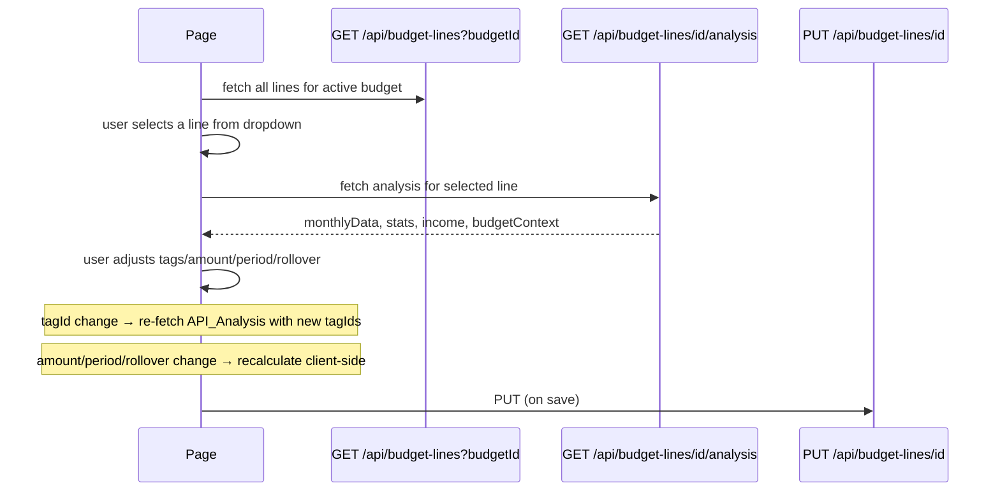

# Fine Tune Budget — Implementation Plan

## Overview

A new page at `/budget/fine-tune` that lets users analyze historical spending for any budget line and interactively
adjust its parameters (tags, amount, period, rollover) to see projected vs actual spending, with smart suggestions and a
traffic-light fit indicator.

---

## Route & Navigation

| Item             | Value                                                    |
| ---------------- | -------------------------------------------------------- |
| URL              | `/budget/fine-tune`                                      |
| Query param      | `?lineId=<budgetLineId>` (optional — pre-selects a line) |
| Sidebar icon     | `SlidersHorizontal` from lucide-react                    |
| Sidebar label    | `Fine Tune`                                              |
| Sidebar position | Below "Budget"                                           |

The budget page's `SortableLineRow` gets a small "fine-tune" icon button that opens `/budget/fine-tune?lineId=<id>`.

---

## Data Flow



---

## New API Endpoint

### `GET /api/budget-lines/:id/analysis`

**Query parameters:**

- `tagIds` (optional) — comma-separated tag IDs to use instead of the budget line's own tags. Used for "what-if" tag
  adjustment preview.

**Logic:**

1. Load the budget line (with its saved tags)
2. Find the active budget (latest budget whose `startDate` <= today)
3. Resolve effective tag IDs: `tagIds` query param if provided, else `budgetLine.tags`; then expand descendants via
   `collectDescendantTagIds`
4. Load all **non-archived** transactions from `budget.startDate` to today
5. Group by calendar month (`YYYY-MM`), summing `debit - credit` per month (never negative — clamp to 0)
6. Fill in zero-spend months so every month from budget start to today is represented
7. Calculate stats (see below)
8. Load income sources for the active budget → sum `getYearlyAmount(netAmount, netPeriod)` → `totalYearlyIncome`
9. Load all other budget lines → sum `getYearlyAmount(amount, period)` → `totalYearlyBudget` (excluding this line)

**Response shape:**

```typescript
interface FineTuneAnalysisResponse {
  budgetLine: BudgetLineWithTags;
  activeBudget: { id: string; startDate: string };
  monthlyData: {
    month: string; // "2024-01"
    spending: number; // debit - credit, clamped >= 0
    transactionCount: number;
  }[];
  stats: {
    average: number; // mean across all months (incl. zeros)
    stdDev: number; // sample std dev
    min: number;
    max: number;
    cv: number; // coefficient of variation = stdDev / average
    monthCount: number; // total calendar months represented
    nonZeroMonthCount: number;
    totalSpending: number;
    highestMonth: string | null; // "2024-03"
    lowestNonZeroMonth: string | null;
  };
  totalYearlyIncome: number;
  totalYearlyBudget: number; // all OTHER lines annualized
}
```

**File:** `src/app/api/budget-lines/[id]/analysis/route.ts`

---

## Client-side Calculations (No Extra API Calls)

When the user changes **amount**, **period**, or **rollover** — recalculate locally:

| Metric                         | Formula                                                         |
| ------------------------------ | --------------------------------------------------------------- | -------------------------------- | ------------------------ |
| Projected yearly budget        | `getYearlyAmount(draftAmount, draftPeriod)`                     |
| Monthly budget equivalent      | `projectedYearly / 12`                                          |
| Expected yearly (from history) | `stats.average * 12`                                            |
| % of total yearly income       | `projectedYearly / totalYearlyIncome * 100`                     |
| % of total yearly budget       | `projectedYearly / (totalYearlyBudget + projectedYearly) * 100` |
| Fit delta %                    | `                                                               | projectedYearly - expectedYearly | / expectedYearly \* 100` |

**Traffic light thresholds** (fit delta %):

- 🟢 **Green** — ≤ 10% (budget closely matches history)
- 🟡 **Yellow** — 11–25% (moderate mismatch)
- 🔴 **Red** — > 25% (significant mismatch)

When the user changes **tags** — re-fetch the analysis API with new `tagIds`.

---

## Statistics & Suggestions

### Variability label

| CV          | Label    | Color  |
| ----------- | -------- | ------ |
| < 0.15      | Low      | green  |
| 0.15 – 0.40 | Moderate | yellow |
| > 0.40      | High     | red    |

### Smart suggestions (rules-based)

| Condition                                                                         | Suggestion                                                                         |
| --------------------------------------------------------------------------------- | ---------------------------------------------------------------------------------- |
| `cv < 0.20 && rollover === true`                                                  | "Spending is very consistent — consider turning rollover OFF"                      |
| `cv > 0.50 && period !== 'yearly'`                                                | "Spending is highly irregular — consider a yearly budget or rollover"              |
| Yearly pattern: `nonZeroMonthCount <= 3 && nonZeroMonthCount / monthCount < 0.30` | "This looks like an infrequent/annual expense — consider setting period to Yearly" |
| `projectedYearly > expectedYearly * 1.25`                                         | "Your budget may be too generous — history suggests $X/year"                       |
| `projectedYearly < expectedYearly * 0.75`                                         | "Your budget may be too tight — history suggests $X/year"                          |
| `monthCount < 3`                                                                  | "Only N months of data — suggestions will improve with more history"               |

---

## Chart Design

**Component:** `SpendingHistoryChart`

Uses recharts `ComposedChart` (bars + reference lines):

| Element                   | Visual                                                      |
| ------------------------- | ----------------------------------------------------------- |
| Monthly spending          | Vertical bars (amber)                                       |
| Average line              | Solid horizontal reference line (blue)                      |
| Average ± stdDev band     | Semi-transparent shaded `ReferenceArea` (blue, 20% opacity) |
| Monthly budget equivalent | Dashed horizontal reference line (green)                    |
| Legend                    | Shows all three lines                                       |

X-axis: calendar months since budget start.  
Y-axis: currency formatted.  
Tooltip: shows month, spending, budget, avg, deviation from avg.

---

## Page Layout

```
┌─────────────────────────────────────────────────────────┐
│  Fine Tune Budget                     [← Back to Budget] │
├─────────────────────────────────────────────────────────┤
│  Budget Line: [Select a line ▾]                          │
├───────────────────────────┬─────────────────────────────┤
│  Spending History Chart   │  Configuration Panel        │
│  (60% width)              │  (40% width)                │
│                           │  Tags (add/remove)          │
│                           │  Amount  [______]           │
│                           │  Period  [monthly ▾]        │
│                           │  Rollover [toggle]          │
├───────────────────────────┴─────────────────────────────┤
│  Stats Cards (horizontal row)                            │
│  [Avg/mo] [StdDev] [CV / Variability] [Total Spent]     │
│  [Projected/yr] [% of Income] [% of Budget] [🟢 Fit]    │
├─────────────────────────────────────────────────────────┤
│  Suggestions Panel                                       │
│  ⚡ "Spending is consistent — consider disabling rollover"│
│  ⚡ "Budget is $X/yr more than historical average"       │
├─────────────────────────────────────────────────────────┤
│                               [Cancel]  [Update Budget] │
└─────────────────────────────────────────────────────────┘
```

---

## Component Decomposition

All files follow the project's decomposition rules (page ≤ 350 lines, feature components ≤ 250 lines).

### New files

| File                                                  | Purpose                                                      | Approx lines |
| ----------------------------------------------------- | ------------------------------------------------------------ | ------------ |
| `src/app/budget/fine-tune/page.tsx`                   | Page orchestration: fetch, state, layout                     | ≤ 320        |
| `src/app/api/budget-lines/[id]/analysis/route.ts`     | API route                                                    | ≤ 120        |
| `src/components/fine-tune/constants.ts`               | TypeScript types, stat helper functions, threshold constants | ≤ 100        |
| `src/components/fine-tune/spending-history-chart.tsx` | ComposedChart with bars + reference lines                    | ≤ 200        |
| `src/components/fine-tune/stats-cards.tsx`            | 8-card summary grid                                          | ≤ 180        |
| `src/components/fine-tune/budget-fit-indicator.tsx`   | Traffic light circle + label + tooltip                       | ≤ 80         |
| `src/components/fine-tune/line-config-panel.tsx`      | Tags selector, amount, period, rollover controls             | ≤ 220        |
| `src/components/fine-tune/suggestions-panel.tsx`      | Rules-based insights list                                    | ≤ 100        |

### Modified files

| File                                          | Change                                                                                 |
| --------------------------------------------- | -------------------------------------------------------------------------------------- |
| `src/components/layout/sidebar.tsx`           | Add `{ href: '/budget/fine-tune', label: 'Fine Tune', icon: SlidersHorizontal }`       |
| `src/components/budget/sortable-line-row.tsx` | Add a small `SlidersHorizontal` icon button linking to `/budget/fine-tune?lineId=<id>` |
| `src/types/index.ts`                          | Add `FineTuneAnalysisResponse` and related types                                       |

---

## Edge Cases

| Scenario                                  | Handling                                                                   |
| ----------------------------------------- | -------------------------------------------------------------------------- |
| No budget exists                          | Show "Create a budget first" empty state                                   |
| No budget lines exist                     | Show "Add budget lines to your budget first"                               |
| Line has no tags                          | Show spending = $0 across all months + note "No tags linked"               |
| < 2 months of data                        | Stats render but stdDev = 0, variability = "N/A", traffic light is grey    |
| Budget start date is today                | 1 month of (potentially partial) data — labelled "Current month (partial)" |
| Yearly subscription pattern               | Detected and flagged in suggestions                                        |
| Monthly spending is all-zero              | Budget might be correct (future-dated line) — show neutral state           |
| tagIds param references non-existent tags | Silently ignored (empty spending)                                          |

---

## Key Design Decisions

1. **Monthly granularity** — The chart always shows calendar months, regardless of the budget line's period. This makes
   it comparable across different period types.

2. **Zero-fill gaps** — Months with no transactions are included as $0 bars so the timeline is continuous and the
   average/stdDev is accurate to true monthly cost.

3. **"What-if" tag changes trigger API re-fetch** — Tag membership determines which transactions are counted, so this
   cannot be done client-side without duplicating the matching logic.

4. **Amount/period/rollover changes are client-side** — These only affect projected yearly calculations, which are
   simple math on already-fetched data.

5. **Rollover NOT simulated in preview** — The configuration panel's rollover toggle is for saving the setting, not for
   simulating rollover accumulation in the chart. The chart always shows raw monthly spending.

6. **Income sources provide yearly income context** — Fetched via the analysis API from the active budget's income
   sources, summed to yearly via `getYearlyAmount`.

7. **Draft state** — The page holds `draftConfig = { tagIds, amount, period, rollover }`. "Update" PUTs to the API. "
   Cancel" resets draft to match the loaded budget line. The URL `?lineId=` is read-only.
