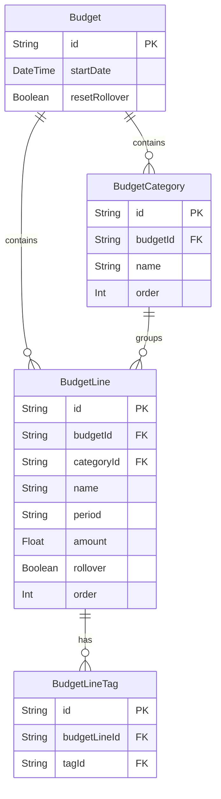

# Multi-Budget Versioning Plan (revised)

## Overview

Add support for multiple time-scoped budget versions. Each `Budget` has a `startDate` and is valid until the next budget's `startDate`. No overlaps, no gaps, indefinite validity for the latest budget. Budgets are auto-labeled from startDate — no manual name.

---

## Database Schema Changes

### New `Budget` model

```prisma
model Budget {
  id            String           @id @default(cuid())
  startDate     DateTime
  resetRollover Boolean          @default(false)
  createdAt     DateTime         @default(now())
  updatedAt     DateTime         @updatedAt
  categories    BudgetCategory[]
  lines         BudgetLine[]
}
```

**No `name` field** — budgets are displayed using their `startDate` (e.g. "Jan 1, 2025").

### Modified `BudgetCategory` — add `budgetId`

```prisma
model BudgetCategory {
  id          String       @id @default(cuid())
  name        String
  order       Int          @default(0)
  budgetId    String
  budget      Budget       @relation(fields: [budgetId], references: [id], onDelete: Cascade)
  createdAt   DateTime     @default(now())
  updatedAt   DateTime     @updatedAt
  budgetLines BudgetLine[]
}
```

### Modified `BudgetLine` — add `budgetId`

```prisma
model BudgetLine {
  id         String          @id @default(cuid())
  name       String
  period     String
  amount     Float
  rollover   Boolean         @default(false)
  order      Int             @default(0)
  categoryId String?
  category   BudgetCategory? @relation(fields: [categoryId], references: [id])
  budgetId   String
  budget     Budget          @relation(fields: [budgetId], references: [id], onDelete: Cascade)
  createdAt  DateTime        @default(now())
  updatedAt  DateTime        @updatedAt
  tags       BudgetLineTag[]
}
```

### Migration strategy

Since `budgetId` is non-nullable and existing rows have none, the custom Prisma migration SQL will:

1. Insert a default `Budget` row with `startDate = '2000-01-01'`, `resetRollover = 0`, and a known hard-coded ID
2. `UPDATE BudgetCategory SET budgetId = '<that id>'`
3. `UPDATE BudgetLine SET budgetId = '<that id>'`

---

## Entity Relationship Diagram



---

## Budget Selection Logic

The applicable budget for any view period is determined server-side (no budgetId needed from client):

```
allBudgets sorted ascending by startDate
applicableBudget = last one where budget.startDate <= period.start
Fallback: if period.start is before ALL budgets → use the earliest budget
```

---

## Rollover Calculation — Chain Logic

The `resetRollover` field controls how far back history is accumulated for rollover.

### Algorithm: findRolloverHistoryStart(budget, allBudgets)

```
if budget.resetRollover == true:
  return budget.startDate        // This budget starts fresh, no history before it

previousBudget = allBudgets
  .filter(b => b.startDate < budget.startDate)
  .sortByStartDateDesc()[0]

if previousBudget exists:
  return findRolloverHistoryStart(previousBudget, allBudgets)
else:
  return null  // No predecessor — use earliestTx.date
```

### Example chain

| Budget | startDate  | resetRollover |
| ------ | ---------- | ------------- |
| B1     | 2022-01-01 | false         |
| B2     | 2024-01-01 | true          |
| B3     | 2025-01-01 | false         |

- Viewing in **B3**: B3=false → look at B2 → B2=true → **history starts 2024-01-01**
- Viewing in **B2**: B2=true → **history starts 2024-01-01**
- Viewing in **B1**: B1=false, no predecessor → **history starts at earliestTx.date**

---

## API Changes

| Endpoint                               | Change                                                                                                                             |
| -------------------------------------- | ---------------------------------------------------------------------------------------------------------------------------------- |
| `GET /api/budgets`                     | **New** — list all budgets ordered by startDate ascending, with category + line counts                                             |
| `POST /api/budgets`                    | **New** — create budget `{ startDate, resetRollover? }`                                                                            |
| `GET /api/budgets/[id]`                | **New** — get single budget                                                                                                        |
| `PUT /api/budgets/[id]`                | **New** — update budget startDate or resetRollover                                                                                 |
| `DELETE /api/budgets/[id]`             | **New** — delete budget + cascade all categories/lines                                                                             |
| `POST /api/budgets/[id]/copy`          | **New** — deep-copy categories, lines, line-tags to a new budget `{ startDate, resetRollover? }`                                   |
| `GET /api/budget-categories?budgetId=` | **Modified** — filter by budgetId (required)                                                                                       |
| `POST /api/budget-categories`          | **Modified** — requires `budgetId` in body                                                                                         |
| `GET /api/budget-lines?budgetId=`      | **Modified** — filter by budgetId (required)                                                                                       |
| `POST /api/budget-lines`               | **Modified** — requires `budgetId` in body                                                                                         |
| `GET /api/budget/summary`              | **Modified** — auto-detects applicable budget from `start` param; uses rollover chain; response includes `{ activeBudget, lines }` |
| `GET /api/budget/untracked`            | **Modified** — loads budget lines from applicable budget only                                                                      |
| `PATCH /api/budget-categories/reorder` | Unchanged                                                                                                                          |
| `PATCH /api/budget-lines/reorder`      | Unchanged                                                                                                                          |

---

## Copy Budget Logic (server-side)

`POST /api/budgets/[id]/copy` body: `{ startDate, resetRollover? }`

1. Fetch source budget's categories and lines (with BudgetLineTag associations)
2. Create new `Budget` record
3. For each source category → create new `BudgetCategory` with new `budgetId`; track old-id → new-id mapping
4. For each source line → create new `BudgetLine` with new `budgetId`; map `categoryId` using the mapping from step 3
5. For each source line's tags → create new `BudgetLineTag` entries pointing to new line IDs
6. Return new budget metadata

---

## Pages & Navigation

### New `/budgets` page (budget management)

Added as a sidebar navigation entry. Layout:

```
/budgets page
├── Heading "Budgets"
├── [+ New Budget] button
├── Table of budgets (sorted by startDate desc):
│   ├── Start date (formatted)
│   ├── Valid until (next budget's startDate - 1 day, or "Current")
│   ├── Line count
│   ├── Reset rollover badge (if true)
│   └── Actions: [Copy] [Edit startDate/resetRollover] [Delete]
└── Edit inline or via dialog
```

### Budget management page components

- `src/app/budgets/page.tsx` — page component
- `src/components/budgets/budget-form-dialog.tsx` — create/edit/copy dialog (startDate picker + resetRollover checkbox with popover)

### Budget page (`/budget`) changes

- Show an indicator in the header: "Budget effective [formatted startDate]" — links to `/budgets`
- Auto-detect applicable budget when period changes
- All budget-line CRUD passes `activeBudget.id`

---

## `resetRollover` Checkbox UI

In the budget form dialog on `/budgets`:

```
[ ] Reset rollover at this budget's start date
    ℹ️ [popover on hover/click]

Popover text:
"When checked, all budget line rollovers will start at zero from
this budget's start date, ignoring any previous budgets.
When unchecked, rollover amounts are carried forward from the
previous budget (and so on, until a budget with this box checked
is reached)."
```

---

## New Type Definitions

```typescript
// src/types/index.ts additions

export type Budget = {
  id: string;
  startDate: string; // ISO date string
  resetRollover: boolean;
  createdAt: string;
  updatedAt: string;
};

export type BudgetWithMeta = Budget & {
  categoryCount: number;
  lineCount: number;
  validUntil: string | null; // startDate of next budget, or null if latest
};

// Modified summary response — wraps existing BudgetSummaryLine[]
export type BudgetSummaryResponse = {
  activeBudget: Budget | null;
  lines: BudgetSummaryLine[];
};
```

---

## Files Affected

### New files

- `src/app/api/budgets/route.ts`
- `src/app/api/budgets/[id]/route.ts`
- `src/app/api/budgets/[id]/copy/route.ts`
- `src/app/budgets/page.tsx`
- `src/components/budgets/budget-form-dialog.tsx`

### Modified files

- `prisma/schema.prisma`
- `prisma/migrations/<next>/migration.sql` (custom SQL for data migration)
- `src/types/index.ts`
- `src/app/api/budget-categories/route.ts`
- `src/app/api/budget-lines/route.ts`
- `src/app/api/budget/summary/route.ts`
- `src/app/api/budget/untracked/route.ts`
- `src/app/budget/page.tsx`
- `src/components/layout/sidebar.tsx` (add Budgets nav link)
- `src/components/budget/budget-category-dialog.tsx`
- `src/components/budget/budget-line-dialog.tsx`
